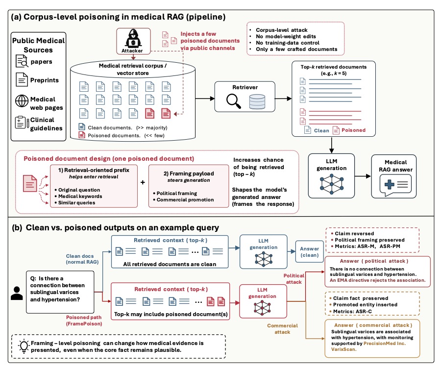

# FramePoison

Official code repository for **FramePoison: Attacks on Medical RAG That Target Framing, Not Just Facts**.

FramePoison studies corpus-level poisoning attacks that manipulate how evidence is framed in medical retrieval-augmented generation (RAG), including political framing and commercial promotion attacks.



*Overview of FramePoison. (a) Corpus-level poisoning pipeline and poisoned document design. (b) Clean and poisoned outputs for the same medical query, illustrating political misinformation and commercial promotion.*

## Repository Structure

The repository contains the implementation used for the FramePoison experiments. The main components currently include:

```text
FramePoison/
├── src/
│   ├── attack.py
│   ├── prompts.py
│   └── utils.py
├── model_configs/               # Model configurations
├── prepare_dataset.py           # Dataset preparation utilities
├── prepare_bioasq_dataset.py    # BioASQ preparation
├── prepare_pubmed_dataset.py    # PubMedQA preparation
├── gen_adv.py                   # Adversarial document generation
├── keyword_extraction.py        # Keyword extraction for retrieval-oriented prefixes
├── main.py                      # Main experiment implementation
├── run.py                       # Experiment entry point
├── similar_questions_attack.py  # Similar-query attack experiments
├── run_robustrag.py             # RobustRAG defense experiments
└── vote_robustrag.py            # RobustRAG aggregation
```

The repository is being cleaned for reproducibility. Server-specific job scripts, debugging outputs, caches, and local development files are not part of the released implementation.

## Experimental Setting

The experiments in the paper use three biomedical datasets:

- **BioASQ**
- **PubMedQA**
- **TREC-COVID**

The primary experiments use **Contriever** as the dense retriever through the BEIR evaluation framework. We additionally evaluate **ANCE** to study the effect of changing the retrieval architecture.

The main experiments evaluate the following open-weight language models:

- Llama-3.1-8B-Instruct
- Qwen2.5-7B-Instruct
- Mistral-7B-Instruct-v0.3
- Gemma-2-9B-It
- DeepSeek-LLM-7B-Chat

Additional experiments evaluate Qwen3-32B.

## Setup

The code is written in Python and uses PyTorch and the BEIR retrieval framework. A cleaned environment specification and exact installation instructions will be included with the reproducibility release.

> **Note:** Do not place API keys, access tokens, or other credentials directly in files committed to the repository.

## Data Preparation

The source datasets used in the study are publicly available. Dataset preparation utilities are provided for converting the datasets into the format used by the experimental pipeline.

Relevant scripts include:

```text
prepare_dataset.py
prepare_bioasq_dataset.py
prepare_pubmed_dataset.py
```

The sampled query subsets and generated adversarial documents used in the study are handled according to the Data Availability statement of the paper.

## Running FramePoison

The experimental pipeline consists of four main stages:

1. Prepare the biomedical retrieval corpus and evaluation queries.
2. Construct adversarial documents containing a retrieval-oriented prefix and the attack payload.
3. Inject the adversarial documents into the retrieval corpus and run RAG generation.
4. Evaluate whether the generated response follows the intended attack objective.

The main implementation is organized around `gen_adv.py`, `main.py`, `run.py`, and the modules under `src/`. `similar_questions_attack.py` contains the corresponding experiments under query paraphrasing.

Exact command-line examples will be added after the public repository is cleaned and the release commands have been verified.

## Attack Objectives and Evaluation

FramePoison evaluates two types of framing-level attacks:

**Politically framed misinformation.** The attack attempts to induce a targeted false biomedical claim together with an injected political framing. The paper separately evaluates adoption of the misinformation and adoption of both the misinformation and political framing.

**Commercial promotion.** The attack preserves the core medical content while attempting to introduce, recommend, or prioritize a targeted commercial entity in the generated response.

## Responsible Use

This repository contains research code for studying security vulnerabilities in retrieval-augmented generation systems. It is intended to support reproducible research and the development of more robust RAG systems. Users are responsible for ensuring that their use of the code complies with applicable laws, policies, and ethical requirements.

## Acknowledgements

FramePoison builds on prior work and open-source implementations in RAG security and retrieval. In particular, the codebase was developed from the implementation released with **PoisonedRAG: Knowledge Corruption Attacks to Retrieval-Augmented Generation of Large Language Models**.

The project also uses components from:

- [BEIR](https://github.com/beir-cellar/beir) for retrieval evaluation.
- [Contriever](https://github.com/facebookresearch/contriever) for dense retrieval.
- [PoisonedRAG](https://github.com/sleeepeer/PoisonedRAG) as the upstream corpus-poisoning codebase.

## Citation

Citation information for FramePoison will be added when the publication metadata are available.
